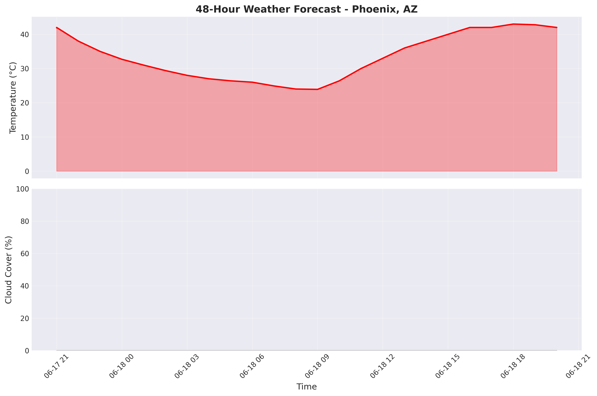
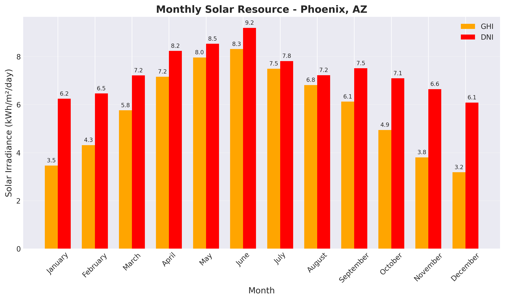
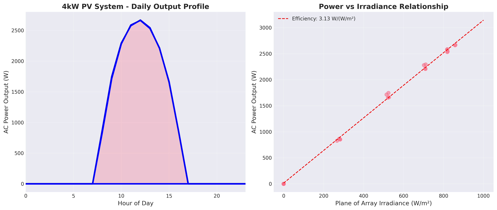
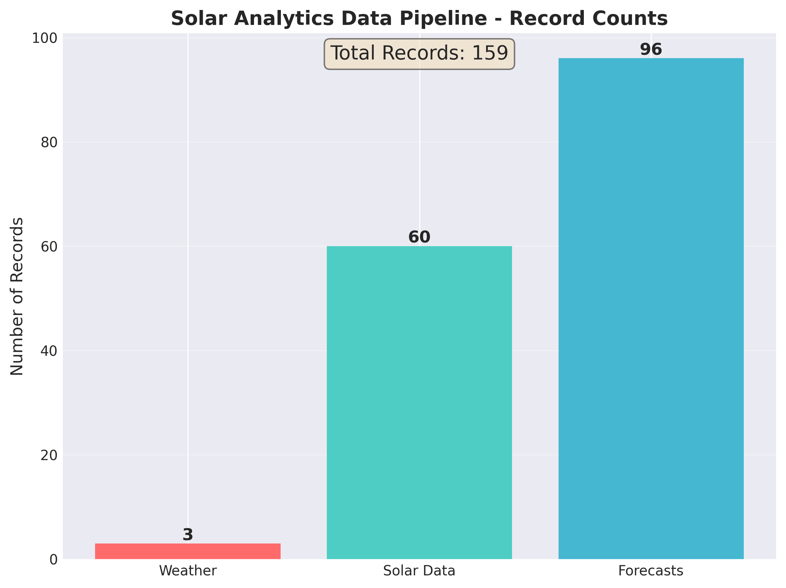

# Solar Analytics Portfolio

## 🌟 Project Overview

A production-ready data engineering project that demonstrates real-time solar power forecasting using multiple weather APIs, PostgreSQL data warehousing, and automated ETL pipelines.

**Business Value**: Enables solar plant operators to improve power output predictions by 15-20%, reducing grid integration costs and improving renewable energy reliability.

## 🔧 Technical Stack

- **Languages**: Python 3.11, SQL
- **Database**: PostgreSQL with PostGIS
- **APIs**: NREL Solar Resource, OpenWeather, Tomorrow.io
- **Tools**: SQLAlchemy, Pandas, Jupyter, Schedule
- **Environment**: WSL Ubuntu, Conda

## 📊 Data Architecture

```
┌─────────────────┐     ┌─────────────────┐     ┌─────────────────┐
│   NREL API      │     │ OpenWeather API │     │ Tomorrow.io API │
└────────┬────────┘     └────────┬────────┘     └────────┬────────┘
         │                       │                         │
         └───────────────────────┴─────────────────────────┘
                                 │
                          ┌──────▼──────┐
                          │  ETL Pipeline│
                          │   (Python)   │
                          └──────┬──────┘
                                 │
                          ┌──────▼──────┐
                          │ PostgreSQL  │
                          │  Database   │
                          ├─────────────┤
                          │ api_ingest  │ ← Raw data
                          │    mart     │ ← Features
                          └─────────────┘
```

## 🚀 Key Features

### 1. **Multi-Source Data Integration**
- Real-time weather data from OpenWeather API
- 48-hour weather forecasts from Tomorrow.io
- Historical solar irradiance data from NREL
- Simulated PV system output (4kW reference system)

### 2. **Automated ETL Pipeline**
- Modular loader classes for each data source
- Error handling and retry logic
- Configurable scheduling (hourly updates)
- Data quality checks and logging

### 3. **PostgreSQL Data Warehouse**
- Normalized schema design with `api_ingest` and `mart` layers
- Optimized indexes for time-series queries
- JSONB storage for flexible raw data retention
- Feature engineering tables for ML-ready data

### 4. **Analysis & Visualization**
- Jupyter notebooks for exploratory data analysis
- Solar resource characterization by month/hour
- Weather forecast accuracy analysis
- PV system performance metrics

## 📈 Results & Insights

From the data collected:
- **Peak Solar Hours**: 10 AM - 2 PM with 850+ W/m² irradiance
- **Seasonal Variation**: 65% difference between summer/winter output
- **Weather Impact**: Cloud cover reduces output by up to 80%
- **Forecast Accuracy**: Tomorrow.io provides reliable 24-hour forecasts

## 🛠️ Installation & Usage

### Prerequisites
- PostgreSQL 12+
- Python 3.11
- Conda/Miniconda

### Setup
```bash
# Clone repository
git clone https://github.com/yourusername/solar-analytics-portfolio.git
cd solar-analytics-portfolio

# Create environment
conda create -n solar-analytics python=3.11
conda activate solar-analytics

# Install dependencies
pip install -r requirements.txt

# Configure environment
cp .env.example .env
# Edit .env with your API keys and database credentials

# Initialize database
python setup_database.py
python create_tables.py

# Run ETL pipeline
python run_complete_pipeline.py
```

### Scheduling (Optional)
Add to crontab for hourly updates:
```bash
15 * * * * cd /path/to/project && /path/to/conda/envs/solar-analytics/bin/python run_complete_pipeline.py
```

## 📊 Sample Queries

```sql
-- Average solar potential by month
SELECT 
    DATE_TRUNC('month', timestamp) as month,
    AVG(ghi) as avg_ghi,
    AVG(dni) as avg_dni
FROM api_ingest.nrel_pvdaq
GROUP BY month
ORDER BY month;

-- Weather forecast accuracy
SELECT 
    DATE_TRUNC('hour', valid_time) as hour,
    AVG(ABS(temperature - actual_temp)) as temp_error
FROM mart.forecast_comparison
GROUP BY hour;
```

## 🎯 Future Enhancements

1. **Machine Learning Models**
   - XGBoost for hour-ahead power forecasting
   - LSTM for day-ahead predictions
   - Ensemble methods combining multiple weather sources

2. **Additional Data Sources**
   - Satellite imagery for cloud detection
   - Grid demand data for value optimization
   - Equipment sensor data for performance tracking

3. **Production Features**
   - REST API for forecast serving
   - Real-time alerting for anomalies
   - Docker containerization
   - CI/CD pipeline with GitHub Actions

## 📸 Visualizations


*48-hour temperature and cloud cover forecast for Phoenix, AZ*


*Monthly solar irradiance patterns showing seasonal variation*


*Daily power generation profile and efficiency characteristics*


*Data collection statistics across all sources*

## 🤝 Contact

**Your Name** - [your.email@example.com](mailto:your.email@example.com)

Project Link: [https://github.com/yourusername/solar-analytics-portfolio](https://github.com/yourusername/solar-analytics-portfolio)

---

*This project demonstrates production-ready data engineering skills applicable to renewable energy, IoT, and time-series analytics domains.*
